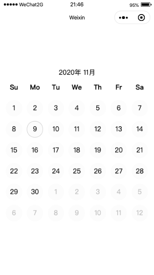

# miniprogram-calendar 

> 一个简单的原生的微信小程序日历组件



## 使用方法

1、下载本项目，把calendar目录放在小程序中，在相应的页面配置文件中配置即可：

```
"usingComponents": {
  "calendar": "../calendar/index"
}
```

2、page页中

```
<calendar />
```

或指定一个年月
```
<calendar year="2020" month="12"  />
```

也可以绑定一个事件，用于获取用户点击时产生的具体年月日：
```
<calendar bind:select="on_select" />
```

也可以绑定一个当前页面显示的所有日子，包括上个月月尾，本月和下个月月初的日子：
```
<calendar bind:screendays="on_screendays" />
```


参考

[1]使用原生JavaScript做一个简单日历 LouisTsang
https://blog.csdn.net/weixin_38179158/article/details/89963352?utm_medium=distribute.pc_aggpage_search_result.none-task-blog-2~all~first_rank_v2~rank_v28-8-89963352.nonecase&utm_term=%E7%94%A8javascript%E8%8E%B7%E5%8F%96%E6%97%A5%E5%8E%86&spm=1000.2123.3001.4430

[2]自定义组件 腾讯
https://developers.weixin.qq.com/miniprogram/dev/framework/custom-component/
